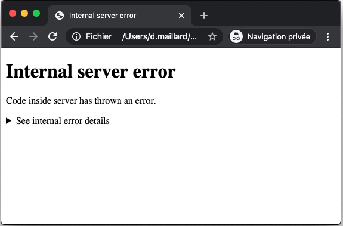
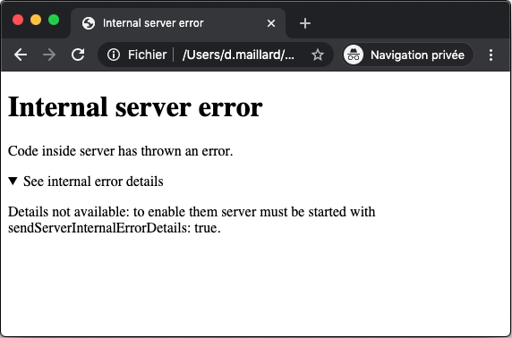

# Table of contents

- [startServer example](#startServer-example)
- [startServer parameters](#startServer-parameters)
  - [http2](#http2)
  - [http1Allowed](#http1Allowed)
  - [redirectHttpToHttps](#redirectHttpToHttps)
  - [protocol](#protocol)
  - [privateKey](#privateKey)
  - [certificate](#certificate)
  - [ip](#ip)
  - [port](#port)
  - [portHint](#portHint)
  - [forcePort](#forcePort)
  - [requestToResponse](#requestToResponse)
    - [request](#request)
    - [response](#response)
  - [accessControl parameters](#accessControl-parameters)
    - [accessControlAllowedOrigins](#accessControlAllowedOrigins)
    - [accessControlAllowedMethods](#accessControlAllowedMethods)
    - [accessControlAllowedHeaders](#accessControlAllowedHeaders)
    - [accessControlAllowRequestOrigin](#accessControlAllowRequestOrigin)
    - [accessControlAllowRequestMethod](#accessControlAllowRequestMethod)
    - [accessControlAllowRequestHeaders](#accessControlAllowRequestHeaders)
    - [accessControlAllowCredentials](#accessControlAllowCredentials)
    - [accessControlMaxAge](#accessControlMaxAge)
  - [logLevel](#logLevel)
  - [stopOnSIGINT](#stopOnSIGINT)
  - [stopOnExit](#stopOnExit)
  - [stopOnInternalError](#stopOnInternalError)
  - [Server internal error](#Server-internal-error)
  - [keepProcessAlive](#keepProcessAlive)
  - [requestWaitingCallback](#requestWaitingCallback)
  - [requestWaitingMs](#requestWaitingMs)
  - [startedCallback](#startedCallback)
  - [stoppedCallback](#stoppedCallback)
- [startServer return value](#startServer-return-value)
  - [origin](#origin)
  - [nodeServer](#nodeServer)
  - [stop](#stop)
  - [stoppedPromise](#stoppedPromise)

# startServer example

`startServer` is an async function starting a server.

```js
import { startServer } from "@jsenv/server"

const server = await startServer({
  protocol: "https",
  ip: "127.0.0.1",
  port: 80,
})
```

— source code at [src/startServer.js](../src/startServer.js).

# startServer parameters

## http2

`http2` parameter is a boolean controlling if server uses http2 or http1. This parameter is optional and disabled by default.

## http1Allowed

`http1Allowed` parameter is a boolean controlling if server accepts client requesting it using http1 even if server was started with http2 parameter enabled. This parameter is optional and enabled by default.

— see [allowHTTP1 documentation on Node.js](https://nodejs.org/dist/latest-v13.x/docs/api/http2.html#http2_http2_createsecureserver_options_onrequesthandler)

## redirectHttpToHttps

`redirectHttpToHttps` parameter is a boolean controlling if server will redirect request made to http to https. This parameter is optional and disabled by default.

## protocol

`protocol` parameter is a string which is either `"http"` or `"https"`. This parameter is optional with a default value of `"http"`.

If you use `https` protocol you can provide your own certificate using `privateKey` and `certificate` parameters.
The code below is a basic example showing how you could pass your own certificate.

```js
import { readFileSync } from "fs"
import { startServer } from "@jsenv/server"

startServer({
  protocol: "https",
  privateKey: readFileSync(`${__dirname}/ssl/private.pem`),
  certificate: readFileSync(`${__dirname}/ssl/cert.pem`),
})
```

If you don't have a certificate you can omit the `privateKey` and `certificate` parameters and a default certificate will be used. It can be found inside [src/jsenvSignature.js](../src/jsenvSignature.js). You should trust this certificate in your system/browser settings.

### Trusting jsenv certificate

Jsenv certificate is meant to be used during development, for this reason it's self signed. When your browser encounter a self signed certificate it displays a warning page telling the server certificate is not trustable. This warning can be annoying and browser have specific behaviour when executing a page with a non trusted certificate (for instance chrome disable cache).

The certificate to trust is `jsenvRootCertificate` in [src/jsenvSignature.js](../src/jsenvSignature.js). The way to trust a certificate depends of your browser and operating system:

- Chrome + MacOS or Safari + MacOS
  - Import certificate to keychain https://support.apple.com/en-gb/guide/keychain-access/kyca35961/mac
  - Trust that certificate https://support.apple.com/en-gb/guide/keychain-access/kyca11871/mac
- Firefox
  - Import certificate as documented in https://wiki.mozilla.org/PSM:Changing_Trust_Settings

> If you need a file with the jsenv certificate create a `whatever.crt` file and copy paste `jsenvRootCertificate` value in it.

## privateKey

`privateKey` parameter is a string containing a private key. This parameter is optionnal with a default value exported in [src/jsenvSignature.js](../src/jsenvSignature.js). This parameter will be used when protocol is `https`.

## certificate

`certificate` parameter is a string containing a certificate. This parameter is optionnal with a default value exported in [src/jsenvSignature.js](../src/jsenvSignature.js). This parameter will be used when protocol is `https`.

## ip

`ip` parameter is a string representing the ip server will listen. This parameter is optional with a default value of `"0.0.0.0"`.

`"0.0.0.0"` means server listen every ip for a given port.

## port

`port` parameter is a number representing the port server will listen. This parameter is optional with a default value of `0`.

A value of `0` means server will listen to a random available port. In that case, if you want to know the listened port use [origin](#origin) value returned by startServer.

## portHint

`portHint` parameter is a number representing the port you would like to listen. This parameter is optional with a default value of `undefined` meaning it won't be considered.

When `portHint` is a number and `port` is `0` server will try to listen `portHint` if it's available, otherwise it will try the closest next port until it find an available port to listen.

## forcePort

`forcePort` parameter is a boolean controlling if process using the port will be killed. This parameter is optional with a default value of `false`.

Passing `forcePort` to true when `port` is `0` will throw because it makes no sense.

## requestToResponse

`requestToResponse` parameter is a function responsible to generate a response from a request. This parameter is optional with a default value of `() => null`.

When `requestToResponse` returns `null` or `undefined` server respond to that request with `501 Not implemented`. Below are more information on `request` and `response` objects.

### request

`request` is an object representing an http request. `request` are passed as first argument to `requestToResponse`, see below a `request` example

```js
{
  origin: "http://127.0.0.1:8080",
  ressource: "/index.html?param=1",
  method: "GET",
  headers: { accept: "text/html" },
  body: undefined,
}
```

When underlying http request method is `GET` or `HEAD`, `request.body` is `undefined`.<br />
When underlying http request method is `POST`, `PUT`, `PATCH`, `request.body` is an observable object.

The following code snippet can be used to get `request.body` as string:

```js
import { readRequestBodyAsString } from "@jsenv/server"

const requestBodyString = await readRequestBodyAsString(request.body)
```

### response

`response` is an object describing an http response. `response` are returned must be returned by the code you write inside `requestToResponse`, see below some `response` examples:

- response with a body declared with a string

```js
const response = {
  status: 200,
  headers: { "content-type": "text/plain" },
  body: "Hello world",
}
```

- response with a body declared with a buffer

```js
const response = {
  status: 200,
  headers: { "content-type": "text/plain" },
  body: Buffer.from("Hello world"),
}
```

- response with a body declared with a readable stream

```js
const { createReadStream } = require("fs")

const response = {
  status: 200,
  headers: { "content-type": "text/plain" },
  body: createReadStream("/User/you/folder/file.txt"),
}
```

- response with a body declared with an observable body

```js
const response = {
  status: 200,
  headers: { "content-type": "text/plain" },
  body: {
    [Symbol.observable]: () => {
      return {
        subscribe: ({ next, complete }) => {
          next("Hello world")
          complete()
        },
      }
    },
  },
}
```

## accessControl parameters

All parameters starting with `accessControl` are related to cross origin ressource sharing, also called CORS.

As soon as you pass `accessControlAllowRequestOrigin` or `accessControlAllowedOrigins` it means your server use CORS.

When using CORS, `@jsenv/server` sets CORS headers on all responses generated by [requestToResponse](#requestToResponse) or [serverInternalErrorToResponse](#serverInternalErrorToResponse)

### accessControlAllowedOrigins

`accessControlAllowedOrigins` parameter is an array of origins allowed when requesting your server. This parameter is optional with a default value of `[]`.

### accessControlAllowedMethods

`accessControlAllowedMethods` parameter is an array or methods allowed when requesting your server. This parameter is optional with a default value of `["GET", "POST", "PUT", "DELETE", "OPTIONS"]`

### accessControlAllowedHeaders

`accessControlAllowedHeaders` parameter is an array of headers allowed when requesting your server. This parameter is optional with a default value of `["x-requested-with"]`.

### accessControlAllowRequestOrigin

`accessControlAllowRequestOrigin` parameter is a boolean controlling if request origin is auto allowed. This parameter is optional with a default value of `false`.

Use this parameter to allow any origin.

### accessControlAllowRequestMethod

`accessControlAllowRequestMethod` parameter is a boolean controlling if request method is auto allowed. This parameter is optional with a default value of `false`.

Use this parameter to allowed any request method.

### accessControlAllowRequestHeaders

`accessControlAllowRequestHeaders` parameter is a boolean controlling if request headers are auto allowed. This parameter is optional with a default value of `false`.

Use this parameter to allowed any request headers.

### accessControlAllowCredentials

`accessControlAllowCredentials` parameter is a boolean controlling if request credentials are allowed when requesting your server. This parameter is optional with a default value of `false`.

### accessControlMaxAge

`accessControlMaxAge` parameter is a number representing an amount of seconds that can be used by client to cache access control headers values. This parameter is optional with a default value of `600`.

## logLevel

`logLevel` parameter is a string controlling how much logs server will write in the console. This parameters is otional with a default value of `"info"`.

— see [jsenv/jsenv-logger#logLevel](https://github.com/jsenv/jsenv-logger#logLevel)

## stopOnSIGINT

`stopOnSIGINT` parameter is a boolean controlling if server stops itself when process SIGINT is occurs. This parameters is otional with a default value of `true`.

SIGINT occurs when you hit ctrl+c in your terminal for instance.

## stopOnExit

`stopOnSIGINT` parameter is a boolean controlling if server stops itself when process exits. This parameters is otional with a default value of `true`.

## stopOnInternalError

`stopOnInternalError` parameter is a boolean controlling if server stops itself when `requestToResponse` throw an error. This parameter is optional and disabled by default.

## Server internal error

A server internal error is when an error is thrown inside [requestToResponse](#requestToResponse). When it happens a function becomes responsible to turn this error into an http response. This function is called `serverInternalErrorToResponse`.

### serverInternalErrorToResponse

`serverInternalErrorToResponse` is an async function responsible to generate response for error thrown during server execution. There is a default value for this parameter visible at [src/jsenvServerInternalErrorToResponse.js](../src/jsenvServerInternalErrorToResponse.js).

The default `serverInternalErrorToResponse` value will respond with a generic error page.

<details>
  <summary>Error page without details</summary>

```js
import { startServer } from "@jsenv/server"

startServer({
  requestToResponse: () => {
    throw new Error("test")
  },
})
```





</details>

By default error details are not available, use `sendServerInternalErrorDetails` to enable them.

<details>
  <summary>Error page with details</summary>

```js
import { startServer } from "@jsenv/server"

startServer({
  requestToResponse: () => {
    throw new Error("test")
  },
  sendServerInternalErrorDetails: true,
})
```


</details>

#### Custom serverInternalErrorToResponse

You can customize this behaviour by passing your own `serverInternalErrorToResponse`. This function is asynchronous and receive `error` as first parameter. It can also access `request` and `sendServerInternalErrorDetails` by destructuring its second parameter.

<details>
  <summary>Custom serverInternalErrorToResponse code example</summary>

```js
import { startServer } from "@jsenv/server"

const errorToThrow = new Error("toto")

startServer({
  requestToResponse: () => {
    throw errorToThrow
  },
  serverInternalErrorToResponse: (error, { request, sendServerInternalErrorDetails }) => {
    error === errorToThrow // true

    const body = `An error occured: ${error.message}`

    return {
      status: 500,
      headers: {
        "content-type": "text/plain",
        "content-length": Buffer.byteLength(body),
      },
      body,
    }
  },
})
```

</details>

## keepProcessAlive

`keepProcessAlive` parameter is a boolean controlling if server keeps the process alive. This parameter is otional with a default value of `true`.

When false, if nothing keeps the process alive node process will end even if your server is still listening.

## requestWaitingCallback

`requestWaitingCallback` parameter is a function called when a request is waiting for a long time. This parameter is optional with a default value logging a warning in the console.

## requestWaitingMs

`requestWaitingMs` parameter is a number of milliseconds after which the request is considered as waiting. This parameter is optional with a default value of 20 seconds.

## startedCallback

`startedCallback` parameter is a function called when server starts listening. This parameters is otional with a default value of `() => {}`.

`startedCallback` receives one argument being an object with an origin property representing the server origin like `http://127.0.0.1:8080`.

## stoppedCallback

`stoppedCallback` parameter is a function called when server stops. This parameters is otional with a default value of `() => {}`.

`stoppedCallback` receives one argument being an object with a reason property representing why the server stopped.

Each possible `reason` is an object you can import like this:

```js
import {
  STOP_REASON_INTERNAL_ERROR,
  STOP_REASON_PROCESS_SIGHUP,
  STOP_REASON_PROCESS_SIGTERM,
  STOP_REASON_PROCESS_SIGINT,
  STOP_REASON_PROCESS_BEFORE_EXIT,
  STOP_REASON_PROCESS_EXIT,
  STOP_REASON_NOT_SPECIFIED,
} from "@jsenv/server"
```

`reason` might also be a value you passed yourself:

```js
import { startServer } from "@jsenv/server"

const { stop } = await startServer({
  stoppedCallback: ({ reason }) => {
    reason === 42
  },
})
stop(42)
```

# startServer return value

```js
import { startServer } from "@jsenv/server"

const { origin, nodeServer, stop, stoppedPromise } = await startServer()
```

## origin

`origin` is a string representing the url server is listening to.

An example value could be `"http://127.0.0.1:65289"`

## nodeServer

`nodeServer` is the http_server instance used internally by the server. It exists in case you need to do something on the node server itself.

— see [http_server documentation on node.js](https://nodejs.org/api/http.html#http_class_http_server)

## stop

`stop` is an async function asking server to be stopped.

Stop returns a promise resolved when server is completely stopped.

If you call stop without argument, promise is resolved with `STOP_REASON_NOT_SPECIFIED`, otherwise it is resolved with the value your provided.

## stoppedPromise

`stoppedPromise` is a promise resolved with a reason when server is stopped.

`stoppedPromise` exists because server can be stopped calling `stop` or automatically by parameters like [stopOnSIGINT](#stopOnSIGINT).
