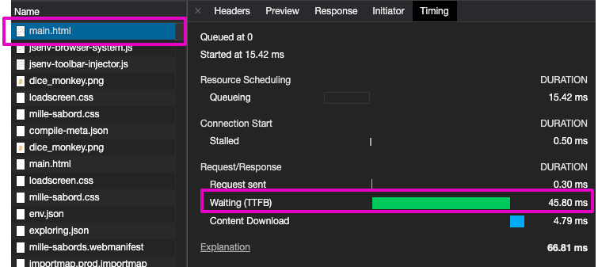
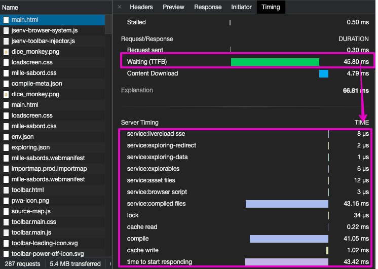

# server

High level api for node.js server.

[](https://github.com/jsenv/jsenv-server/packages)
[](https://www.npmjs.com/package/@jsenv/server)
[](https://github.com/jsenv/jsenv-server/actions?workflow=ci)
[](https://codecov.io/gh/jsenv/jsenv-server)

# Table of contents

- [Presentation](#Presentation)
- [Installation](#Installation)
- [Responding to requests](#Responding-to-requests)
- [Services and composition](#Services-and-composition)
- [Server internal error](#Server-internal-error)
- [Serving files](#Serving-files)
- [Content negotiation](#Content-negotiation)
- [Access control (CORS)](#Access-control-CORS)
- [Protocol and certificate](#Protocol-and-certificate)
- [Server timing](#Server-timing)
- [See also](#See-also)

# Presentation

`@jsenv/server` helps to start server with a simplified api to focus on writing your application code. The api make your code easier to compose and test in isolation.

The following code starts a server listening to `http://127.0.0.1:8080` responding `Hello world` as plain text.

```js
import { startServer } from "@jsenv/server"

const server = await startServer({
  protocol: "https",
  ip: "127.0.0.1",
  port: 8080,
  requestToResponse: () => {
    return {
      status: 200,
      headers: {
        "content-type": "text/plain",
      },
      body: "Hello world",
    }
  },
})
```

— source code at [src/startServer.js](./src/startServer.js).

`@jsenv/server` also exports a commonjs compatible entry point. It means you can `require` it.

```js
const { startServer } = require("@jsenv/server")
```

# Installation

```console
npm install @jsenv/server
```

# Responding to requests

`startServer` provides a clean abstraction around Node.js internals. This abstraction allows you to write pure function responsible to return a response (or not). This pattern is simpler than middleware with the same power.

> Your code becomes easy to unit test and more elegant.

This is achieved thanks to a parameter called `requestToResponse` documented below.

## requestToResponse

`requestToResponse` parameter is a function responsible to generate a response from a request. This parameter is optional with a default value always returning `null`.

> When `requestToResponse` returns `null` or `undefined`, server respond to that request with `501 Not implemented`.

## request

`request` is an object representing an http request. `request` are passed as first argument to `requestToResponse`.

<details>
  <summary>Request object example</summary>

```js
{
  cancellationToken,
  origin: "http://127.0.0.1:8080",
  ressource: "/index.html?param=1",
  method: "GET",
  headers: { accept: "text/html" },
  body: undefined,
}
```

> When http request method is `GET` or `HEAD`, `request.body` is `undefined`.

> When http request method is `POST`, `PUT`, `PATCH`, `request.body` is an observable object.

</details>

<details>
  <summary>Reading request body</summary>

Read body as string

```js
import { startServer, readRequestBody } from "@jsenv/server"

startServer({
  requestToResponse: async (request) => {
    const string = await readRequestBody(request)
  },
})
```

Read body as buffer

```js
import { startServer, readRequestBody } from "@jsenv/server"

startServer({
  requestToResponse: async (request) => {
    const buffer = await readRequestBody(request, { as: "buffer" })
  },
})
```

Read body as json

```js
import { startServer, readRequestBody } from "@jsenv/server"

startServer({
  requestToResponse: async (request) => {
    const json = await readRequestBody(request, { as: "json" })
  },
})
```

</details>

## response

`response` is an object describing a server response. See below some examples that you could return in [requestToResponse](#requestToResponse)

<details>
  <summary>response body declared with a string</summary>

```js
const response = {
  status: 200,
  headers: { "content-type": "text/plain" },
  body: "Hello world",
}
```

</details>

<details>
  <summary>response body declared with a buffer</summary>

```js
const response = {
  status: 200,
  headers: { "content-type": "text/plain" },
  body: Buffer.from("Hello world"),
}
```

</details>

<details>
  <summary>response body declared with a readable stream</summary>

```js
const { createReadStream } = require("fs")

const response = {
  status: 200,
  headers: { "content-type": "text/plain" },
  body: createReadStream("/User/you/folder/file.txt"),
}
```

</details>

<details>
  <summary>response body declared with an observable</summary>

```js
const response = {
  status: 200,
  headers: { "content-type": "text/plain" },
  body: {
    [Symbol.observable]: () => {
      return {
        subscribe: ({ next, complete }) => {
          next("Hello world")
          complete()
        },
      }
    },
  },
}
```

</details>

# Services and composition

In `@jsenv/server` terminology [requestToResponse](#requestToResponse) function is a service.

> A service can be described as an async function receiving a request and returning a response or null.

On a real use case `requestToResponse` needs to be splitted into smaller functions (services) to keep it maintanable. `@jsenv/server` provides an helper for this called `firstService`. It is an async function returning the first response produced by a list of async functions called in sequence.

<details>
  <summary>firstService code example</summary>

```js
import { startServer, firstService } from "@jsenv/server"

const noContentService = (request) => {
  if (request.ressource !== "/") return null
  return { status: 204 }
}

const okService = (request) => {
  if (request.ressource !== "/whatever") return null
  return { status: 200 }
}

startServer({
  requestToResponse: firstService(noContentService, okService),
})
```

> Code above implement a server that could be described as follow:
>
> - when requested at `/`, respond with `204`
> - when requested at `/whatever`, respond with `200`

— source code at [src/service-composition.js](./src/service-composition.js).

</details>

<details>
  <summary>Notes on first service internals</summary>

1. It accepts 0 or more function
2. Set `serviceCandidate` to the first function
3. Calls `serviceCandidate` and **awaits** its `return value`.
4. If `return value` is a non null object it is returned.<br />
   Otherwise, set `serviceCandidate` to the next function and go to step 3

</details>

# Server internal error

A server internal error is when an error is thrown inside [requestToResponse](#requestToResponse). When it happens a function becomes responsible to turn this error into an http response. This function is called `serverInternalErrorToResponse`.

## serverInternalErrorToResponse

`serverInternalErrorToResponse` is an async function responsible to generate response for error thrown during server execution. There is a default value for this parameter visible at [src/jsenvServerInternalErrorToResponse.js](./src/jsenvServerInternalErrorToResponse.js).

The default `serverInternalErrorToResponse` value will respond with a generic error page.

<details>
  <summary>Error page without details</summary>

```js
import { startServer } from "@jsenv/server"

startServer({
  requestToResponse: () => {
    throw new Error("test")
  },
})
```


</details>

By default error details are not available, use `sendServerInternalErrorDetails` to enable them.

<details>
  <summary>Error page with details</summary>

```js
import { startServer } from "@jsenv/server"

startServer({
  requestToResponse: () => {
    throw new Error("test")
  },
  sendServerInternalErrorDetails: true,
})
```


</details>

You can customize this behaviour by passing your own `serverInternalErrorToResponse`. This function is asynchronous and receive `error` as first parameter. It can also access `request` and `sendServerInternalErrorDetails` by destructuring its second parameter.

<details>
  <summary>Custom serverInternalErrorToResponse code example</summary>

```js
import { startServer } from "@jsenv/server"

const errorToThrow = new Error("toto")

startServer({
  requestToResponse: () => {
    throw errorToThrow
  },
  serverInternalErrorToResponse: (error, { request, sendServerInternalErrorDetails }) => {
    error === errorToThrow // true

    const body = `An error occured: ${error.message}`

    return {
      status: 500,
      headers: {
        "content-type": "text/plain",
        "content-length": Buffer.byteLength(body),
      },
      body,
    }
  },
})
```

</details>

# Serving files

A server often needs to serve file without routing logic. Either the file is there and server sends it, or it responds with a 404 status code. You can use `serveFile` exports to do that.

`serveFile` is an async function that will search for a file on your filesysten and produce a response for it.

<details>
  <summary>Serve file code example</summary>

```js
import { startServer, serveFile } from "@jsenv/server"

const rootDirectoryUrl = new URL("./", import.meta.url)

startServer({
  requestToResponse: (request) => {
    return serveFile(request, { rootDirectoryUrl })
  },
})
```

> When request.method is not `"HEAD"` or `"GET"` the returned response correspond to `501 not implemented`.

— source code at [src/serveFile.js](../src/serveFile.js).

</details>

`serveFile` can be configured to handle cache, compression and content types.

## Configuring served files cache

When server receives a request it can decids to respond with `304 Not modified` instead of `200 OK`. A `304` status tells the client it can use its cached version of the response. Consequently `304` responses have an empty body while `200` contains the file content.

By default `serveFile` will always respond with `200`. You can unlock `304` responses using either `etag` or `mtime` based caching.

> `mtime` less robust then `etag` because it assumes filesystem dates are reliable.

<details>
  <summary>Etag headers</summary>

```js
import { startServer, serveFile } from "@jsenv/server"

const rootDirectoryUrl = new URL("./", import.meta.url)

startServer({
  requestToResponse: (request) => {
    return serveFile(request, {
      rootDirectoryUrl,
      etagEnabled: true,
    })
  },
})
```

> When request headers contains `if-none-match`, `serveFile` generates file content etag. The generated etag and the one found in request headers are compared to decide if response is 304 or 200.

</details>

<details>
  <summary>Mtime headers</summary>

```js
import { startServer, serveFile } from "@jsenv/server"

const rootDirectoryUrl = new URL("./", import.meta.url)

startServer({
  requestToResponse: (request) => {
    return serveFile(request, {
      rootDirectoryUrl,
      mtimeEnabled: true,
    })
  },
})
```

> When request headers contains `if-modified-since`, `serveFile` reads file modification time on the filesystem. The filesystem modification time and the one found in request headers are compared to decide if response is 304 or 200. Date comparison is precise to the millisecond.

</details>

It is also possible to configure `cache-control` response header value using `cacheControl` parameter. Remove more about this header at https://developer.mozilla.org/en-US/docs/Web/HTTP/Headers/Cache-Control.

> In dev you likely don't want to enable cache-control headers.

<details>
  <summary>Cache control code example</summary>

```js
import { startServer, serveFile } from "@jsenv/server"

const rootDirectoryUrl = new URL("./", import.meta.url)

startServer({
  requestToResponse: (request) => {
    return serveFile(request, {
      rootDirectoryUrl,
      cacheControl:
        request.ressource === "/"
          ? `private,max-age=0,must-revalidate`
          : `private,max-age=3600,immutable`,
    })
  },
})
```

</details>

## Configuring served files compression

When compression is enabled `serveFile` reads request `accept-encoding` header and uses a compression format if possible. It uses content encoding negotiation documented in [Content negotiation](#Content-negotiation) part. The available compression formats are `gzip`, `brotli` and `deflate`. One (or none) is picked according to the `accept-encoding` request header. To enable compression, use `compressionEnabled` and `compressionSizeThreshold` parameter.

<details>
  <summary>File compression code example</summary>

```js
import { startServer, serveFile } from "@jsenv/server"

const rootDirectoryUrl = new URL("./", import.meta.url)

startServer({
  requestToResponse: (request) => {
    return serveFile(request, {
      rootDirectoryUrl,
      compressionEnabled: true,
      compressionSizeThreshold: 1024,
    })
  },
})
```

</details>

## Configuring served files content type

Jsenv uses file extension to decide the content-type response header. The default content type mapping exported in [src/jsenvContentTypeMap.js](./src/jsenvContentTypeMap.js) contains well known content types used in the web. If one is missing, please submit a pull request to add it. It's also possible to override or extend this mapping using `contentTypeMap` parameter.

<details>
  <summary>Code adding content type mapping</summary>

```js
import { startServer, serveFile, jsenvContentTypeMap } from "@jsenv/server"

startServer({
  requestToResponse: (request) => {
    return serveFile(request, {
      rootDirectoryUrl: "/Users/you/folder/",
      contentTypeMap: {
        ...jsenvContentTypeMap,
        "application/x-whatever": {
          extensions: ["whatever", "whatever-2"],
        },
      },
    })
  },
})
```

</details>

# Content negotiation

You can use `negotiateContentType` to respond with request prefered content type.

<details>
  <summary>Content type negotiation code example</summary>

```js
import { negotiateContentType, startServer } from "@jsenv/server"

startServer({
  requestToResponse: (request) => {
    return respondWithBestContentType(request)
  },
})

const respondWithBestContentType = (request) => {
  const bestContentType = negotiateContentType(request, Object.keys(availableContentTypes))
  return availableContentTypes[bestContentType || "text/plain"]()
}

const availableContentTypes = {
  "application/json": () => {
    const body = JSON.stringify({
      data: "Hello world",
    })
    return {
      headers: {
        "content-type": "application/json",
        "content-length": Buffer.byteLength(body),
      },
      body,
    }
  },
  "text/plain": () => {
    const body = `Hello world`
    return {
      headers: {
        "content-type": "text/plain",
        "content-length": Buffer.byteLength(body),
      },
      body,
    }
  },
}
```

</details>

You can use `negotiateContentLanguage` to respond with request prefered language.

<details>
  <summary>Language negotiation code example</summary>

```js
import { negotiateContentLanguage, startServer } from "@jsenv/server"

startServer({
  requestToResponse: (request) => {
    return respondWithBestLanguage(request)
  },
})

const respondWithBestLanguage = (request) => {
  const bestLanguage = negotiateContentLanguage(request, Object.keys(availableLanguages))
  return availableLanguages[bestLanguage || "en"]()
}

const availableLanguages = {
  fr: () => {
    const body = "Bonjour tout le monde !"
    return {
      headers: {
        "content-type": "text/plain",
        "content-length": Buffer.byteLength(body),
        "content-language": "fr",
      },
      body,
    }
  },
  en: () => {
    const body = `Hello world!`
    return {
      headers: {
        "content-type": "text/plain",
        "content-length": Buffer.byteLength(body),
        "content-language": "en",
      },
      body,
    }
  },
}
```

</details>

You can use `negotiateContentEncoding` to respond with request prefered encoding.

<details>
  <summary>Content encoding negotiation code example</summary>

```js
import { gzipSync } from "zlib"
import { negotiateContentEncoding, startServer } from "@jsenv/server"

startServer({
  requestToResponse: (request) => {
    return respondWithAcceptedEncoding(request)
  },
})

const respondWithAcceptedEncoding = (request) => {
  const acceptedEncoding = negotiateContentEncoding(request, Object.keys(availableEncodings))
  return availableEncodings[acceptedEncoding || "identity"]()
}

const availableEncodings = {
  gzip: () => {
    const body = gzipSync(Buffer.from(`Hello world!`))
    return {
      headers: {
        "content-type": "text/plain",
        "content-encoding": "gzip",
      },
      body,
    }
  },
  identity: () => {
    const body = "Hello world!"
    return {
      headers: {
        "content-type": "text/plain",
        "content-length": Buffer.byteLength(body),
      },
      body,
    }
  },
}
```

</details>

# Access control (CORS)

All parameters starting with `accessControl` are related to cross origin ressource sharing, also called CORS. The default CORS parameters values are set to disable CORS. `@jsenv/server` takes care of setting CORS headers on all responses generated by [requestToResponse](#requestToResponse) or [serverInternalErrorToResponse](#serverInternalErrorToResponse).

> As soon as you pass `accessControlAllowRequestOrigin` or `accessControlAllowedOrigins` parameter it means your server use CORS.

<details>
  <summary>Code enabling CORS for a dev server</summary>

```js
import { startServer } from "@jsenv/server"

startServer({
  accessControlAllowRequestOrigin: true,
  accessControlAllowRequestMethod: true,
  accessControlAllowRequestHeaders: true,
  accessControlAllowCredentials: true,
})
```

</details>

## accessControlAllowedOrigins

`accessControlAllowedOrigins` parameter is an array of origins allowed when requesting your server. This parameter is optional with a default value of `[]`.

## accessControlAllowedMethods

`accessControlAllowedMethods` parameter is an array or methods allowed when requesting your server. This parameter is optional with a default value of `["GET", "POST", "PUT", "DELETE", "OPTIONS"]`

## accessControlAllowedHeaders

`accessControlAllowedHeaders` parameter is an array of headers allowed when requesting your server. This parameter is optional with a default value of `["x-requested-with"]`.

## accessControlAllowRequestOrigin

`accessControlAllowRequestOrigin` parameter is a boolean controlling if request origin is auto allowed. This parameter is optional with a default value of `false`.

Use this parameter to allow any origin.

## accessControlAllowRequestMethod

`accessControlAllowRequestMethod` parameter is a boolean controlling if request method is auto allowed. This parameter is optional with a default value of `false`.

Use this parameter to allowed any request method.

## accessControlAllowRequestHeaders

`accessControlAllowRequestHeaders` parameter is a boolean controlling if request headers are auto allowed. This parameter is optional with a default value of `false`.

Use this parameter to allowed any request headers.

## accessControlAllowCredentials

`accessControlAllowCredentials` parameter is a boolean controlling if request credentials are allowed when requesting your server. This parameter is optional with a default value of `false`.

## accessControlMaxAge

`accessControlMaxAge` parameter is a number representing an amount of seconds that can be used by client to cache access control headers values. This parameter is optional with a default value of `600`.

# Protocol and certificate

`startServer` starts a server in https by default without asking you to provide an https certificate. A default certificate is used and can be found in [src/jsenvSignature.js](./src/jsenvSignature.js). If you don't want to create and [pass your own certificate](#pass-your-own-certificate), you should trust the one in [src/jsenvSignature.js](./src/jsenvSignature.js). It's also possible to disable https using [protocol parameter](#protocol).

## Trusting jsenv certificate

Jsenv certificate is meant to be used during development, for this reason it's self signed. When your browser encounter a self signed certificate it displays a warning page telling the server certificate is not trustable. This warning can be annoying and browser have specific behaviour when executing a page with a non trusted certificate (for instance chrome disable cache).

The certificate to trust is `jsenvRootCertificate` in [src/jsenvSignature.js](./src/jsenvSignature.js). The way to trust a certificate depends of your browser and operating system:

- Chrome + MacOS or Safari + MacOS
  - Import certificate to keychain https://support.apple.com/en-gb/guide/keychain-access/kyca35961/mac
  - Trust that certificate https://support.apple.com/en-gb/guide/keychain-access/kyca11871/mac
- Firefox
  - Import certificate as documented in https://wiki.mozilla.org/PSM:Changing_Trust_Settings

> If you need a file with the jsenv certificate create a `whatever.crt` file and copy paste `jsenvRootCertificate` value in it.

## Using a custom certificate

<details>
  <summary>Code using a custom certificate</summary>

```js
import { readFileSync } from "fs"
import { startServer } from "@jsenv/server"

startServer({
  protocol: "https",
  privateKey: readFileSync(`${__dirname}/ssl/private.pem`),
  certificate: readFileSync(`${__dirname}/ssl/cert.pem`),
})
```

</details>

### privateKey

`privateKey` parameter is a string containing a private key. This parameter is optionnal with a default value exported in [src/jsenvSignature.js](./src/jsenvSignature.js). This parameter will be used when protocol is `https`.

### certificate

`certificate` parameter is a string containing a certificate. This parameter is optionnal with a default value exported in [src/jsenvSignature.js](./src/jsenvSignature.js). This parameter will be used when protocol is `https`.

## protocol

`protocol` parameter is a string which is either `"http"` or `"https"`. This parameter is optional with a default value of `"http"`.

If you use `https` protocol you can provide your own certificate using `privateKey` and `certificate` parameters.

## redirectHttpToHttps

`redirectHttpToHttps` parameter is a boolean controlling if server will redirect request made receiving in http to https. This parameter is optional and enabled by default.

> This parameter is incompatible with [http2 parameter](#http2). If both are enabled a warning is logged and `redirectHttpToHttps` is ignored.

## http2

`http2` parameter is a boolean controlling if server uses http2 or http1. This parameter is optional and disabled by default.

## http1Allowed

`http1Allowed` parameter is a boolean controlling if server accepts client requesting it using http1 even if server was started with http2 parameter enabled. This parameter is optional and enabled by default.

— see [allowHTTP1 documentation on Node.js](https://nodejs.org/dist/latest-v13.x/docs/api/http2.html#http2_http2_createsecureserver_options_onrequesthandler)

# Server timing

Server timing consists into sending headers in the response concerning the server performances. When looking at network panel in chrome devtools you can find a metric called TTFB (Time To First Byte). Without server timing you won't be able to know what your server was doing during that period.

<details>
  <summary>Screenshots of chrome devtools</summary>





Thanks to server timing you know what was going on during these `45.80ms`: `43.16ms` were needed by something called `service:compiled files`.

</details>

Read more in https://developer.mozilla.org/en-US/docs/Web/HTTP/Headers/Server-Timing

You can track each service timing by replacing `firstService` usage seen in [Services and composition](#Services-and-composition) by `firstServiceWithTiming`. It will measure time taken by each function for you.

<details>
  <summary>firstServiceWithTiming code example</summary>

```js
import { startServer, firstServiceWithTiming } from "@jsenv/server"

const noContentService = (request) => {
  if (request.ressource !== "/") return null
  return { status: 204 }
}

const okService = (request) => {
  if (request.ressource !== "/whatever") return null
  return { status: 200 }
}

startServer({
  sendServerTiming: true,
  requestToResponse: firstServiceWithTiming({
    "service:nocontent": noContentService,
    "service:ok": okService,
  }),
})
```

Code above generates a server timing response header that looks like this:

```console
server-timing: a;desc="service:nocontent";dur=0.007546901, b;desc="service:ok";dur=0.0018849
```

</details>

You can also selectively measure time taken by some function using `timeFunction` exports and response `timing` property.

<details>
  <summary>timeFunction code example</summary>

```js
import { timeFunction, startServer } from "@jsenv/server"

startServer({
  sendServerTiming: true,
  requestToResponse: async () => {
    const [waitTiming] = await timeFunction("waiting 50ms", async () => {
      await new Promise((resolve) => {
        setTimeout(resolve, 50)
      })
    })
    const [getMessageTiming, message] = await timeFunction("get message", () => "hello")

    return {
      status: 200,
      headers: {
        "content-type": "text/plain",
      },
      body: message,
      timing: {
        ...waitTiming,
        ...getMessageTiming,
      },
    }
  },
})
```

Code aboves generates a server timing response headers that looks as below

```console
server-timing: a;desc="waiting 50ms";dur=50.7546901, b;desc="get message";dur=0.0018849
```

</details>

# See also

## ip

`ip` parameter is a string representing the ip server will listen. This parameter is optional with a default value of `"0.0.0.0"`.

`"0.0.0.0"` means server listen every ip for a given port.

## port

`port` parameter is a number representing the port server will listen. This parameter is optional with a default value of `0`.

A value of `0` means server will listen to a random available port. In that case, if you want to know the listened port use [origin](#origin) value returned by startServer.

## portHint

`portHint` parameter is a number representing the port you would like to listen. This parameter is optional with a default value of `undefined` meaning it won't be considered.

When `portHint` is a number and `port` is `0` server will try to listen `portHint` if it's available, otherwise it will try the closest next port until it find an available port to listen.

## forcePort

`forcePort` parameter is a boolean controlling if process using the port will be killed. This parameter is optional with a default value of `false`.

Passing `forcePort` to true when `port` is `0` will throw because it makes no sense.

## logLevel

`logLevel` parameter is a string controlling how much logs server will write in the console. This parameters is otional with a default value of `"info"`.

— see [jsenv/jsenv-logger#logLevel](https://github.com/jsenv/jsenv-logger#logLevel)

## stopOnSIGINT

`stopOnSIGINT` parameter is a boolean controlling if server stops itself when process SIGINT is occurs. This parameters is otional with a default value of `true`.

SIGINT occurs when you hit ctrl+c in your terminal for instance.

## stopOnExit

`stopOnSIGINT` parameter is a boolean controlling if server stops itself when process exits. This parameters is otional with a default value of `true`.

## stopOnInternalError

`stopOnInternalError` parameter is a boolean controlling if server stops itself when `requestToResponse` throw an error. This parameter is optional and disabled by default.

## keepProcessAlive

`keepProcessAlive` parameter is a boolean controlling if server keeps the process alive. This parameter is otional with a default value of `true`.

When false, if nothing keeps the process alive node process will end even if your server is still listening.

## requestWaitingCallback

`requestWaitingCallback` parameter is a function called when a request is waiting for a long time. This parameter is optional with a default value logging a warning in the console.

## requestWaitingMs

`requestWaitingMs` parameter is a number of milliseconds after which the request is considered as waiting. This parameter is optional with a default value of 20 seconds.

## startedCallback

`startedCallback` parameter is a function called when server starts listening. This parameters is otional with a default value of `() => {}`.

`startedCallback` receives one argument being an object with an origin property representing the server origin like `http://127.0.0.1:8080`.

## stoppedCallback

`stoppedCallback` parameter is a function called when server stops. This parameters is otional with a default value of `() => {}`.

`stoppedCallback` receives one argument being an object with a reason property representing why the server stopped.

Each possible `reason` is an object you can import like this:

```js
import {
  STOP_REASON_INTERNAL_ERROR,
  STOP_REASON_PROCESS_SIGHUP,
  STOP_REASON_PROCESS_SIGTERM,
  STOP_REASON_PROCESS_SIGINT,
  STOP_REASON_PROCESS_BEFORE_EXIT,
  STOP_REASON_PROCESS_EXIT,
  STOP_REASON_NOT_SPECIFIED,
} from "@jsenv/server"
```

`reason` might also be a value you passed yourself:

```js
import { startServer } from "@jsenv/server"

const { stop } = await startServer({
  stoppedCallback: ({ reason }) => {
    reason === 42
  },
})
stop(42)
```

## startServer return value

```js
import { startServer } from "@jsenv/server"

const { origin, nodeServer, stop, stoppedPromise } = await startServer()
```

## origin

`origin` is a string representing the url server is listening to.

An example value could be `"http://127.0.0.1:65289"`

## nodeServer

`nodeServer` is the http_server instance used internally by the server. It exists in case you need to do something on the node server itself.

— see [http_server documentation on node.js](https://nodejs.org/api/http.html#http_class_http_server)

## stop

`stop` is an async function asking server to be stopped.

Stop returns a promise resolved when server is completely stopped.

If you call stop without argument, promise is resolved with `STOP_REASON_NOT_SPECIFIED`, otherwise it is resolved with the value your provided.

## stoppedPromise

`stoppedPromise` is a promise resolved with a reason when server is stopped.

`stoppedPromise` exists because server can be stopped calling `stop` or automatically by parameters like [stopOnSIGINT](#stopOnSIGINT).
